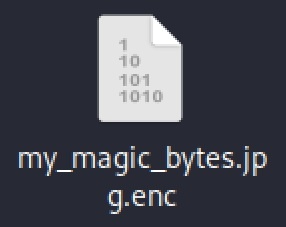

# 🛡️ Writeup CTF - MY MAGIC BYTES

**Categoría:** Criptografía  
**Descripción:**  
> ¿Podés recuperar la clave secreta XOR que usamos para cifrar la flag?

Se proporciona un archivo: `my_magic_bytes.jpg.enc`  
Sabemos que es un archivo JPG cifrado con una clave XOR repetitiva.

---

## 🔍 Objetivo

Recuperar la clave usada para cifrar un archivo JPG usando XOR, y luego descifrarlo completamente.

---

## 🔑 Estrategia

1. Utilizar el conocimiento de los **bytes mágicos de un JPG** (`FF D8 FF E0` y más).
2. Comparar esos bytes con los primeros bytes del archivo cifrado.
3. Hacer una operación XOR entre ambos para extraer la clave.
4. Usar esa clave para descifrar el archivo completo.

---

## ❓ ¿Por qué usamos los bytes del JPG original y qué es XOR?

Los archivos JPG siempre comienzan con una **firma o cabecera** fija llamada "bytes mágicos". Por ejemplo, los primeros 4 bytes casi siempre son: FF D8 FF E0

Esto es como la "huella digital" que identifica que el archivo es una imagen JPEG válida.

Si sabemos que el archivo original tiene esa cabecera y tenemos la versión cifrada, podemos usarla para encontrar la clave que usaron para cifrarlo.

---

### ¿Cómo funciona XOR?

La operación XOR (o exclusivo) es una función lógica que, aplicada a dos bits, devuelve:

- 1 si los bits son diferentes
- 0 si son iguales

Al aplicarlo a bytes (8 bits), se hace bit a bit.

Una propiedad clave del XOR es que es reversible:

Cifrado: TextoOriginal ⊕ Clave = TextoCifrado

Descifrado: TextoCifrado ⊕ Clave = TextoOriginal

Por lo tanto, si tenemos el texto cifrado y el texto original en alguna parte (por ejemplo, los bytes mágicos), podemos obtener la clave:

Clave = TextoOriginal ⊕ TextoCifrado

---

## 🔧 Extrayendo los primeros bytes con `xxd` en la terminal de linux

Usamos el siguiente comando para obtener los primeros 12 bytes en hexadecimal de los archivos:

xxd -p -l 12 my_magic_bytes.jpg.enc
Resultado (cifrado): b914064571e0b5f73707cb85

Y comparamos con los primeros 12 bytes de una imagen JPG legítima:
xxd -p -l 12 imagencualquiera.jpg
Resultado (original): ffd8ffe000104a4649460001

🧪 Script de solución en Python

📸 Resultado

Se recuperó exitosamente la imagen como my_magic_bytes_decrypted.jpg.

✅ El archivo tiene un encabezado JPG válido (FF D8 FF E0), confirmando que el descifrado fue exitoso.

🧠 Resumen

El XOR es una operación reversible que nos permite recuperar el texto original si conocemos la clave.

Usamos los bytes mágicos del JPG porque son fijos y conocidos, lo que nos permite deducir la clave.

Con la clave deducida, podemos descifrar todo el archivo cifrado.

Este tipo de cifrado con clave repetitiva es inseguro si partes del contenido original son conocidas.

