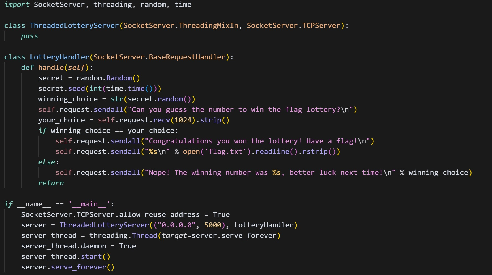
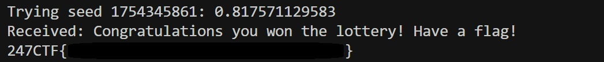

# 🎯 THE FLAG LOTTERY

**Categoría:** MISCELLANEOUS
**Descripción:**  
> ¿Puedes adivinar el número secreto para ganar la lotería? ¡El premio es una bandera!

---

## 🧩 Presentación del problema

Nos enfrentamos a un servidor remoto que ejecuta una "lotería" donde, si adivinás el número secreto generado por el servidor, te entregan la flag. El código fuente del servidor es el siguiente:

📌 Resumen
El servidor genera un número aleatorio utilizando random.Random(), pero lo siembra (seed) con int(time.time()), lo cual lo hace predecible si el cliente conoce (o sincroniza con) la hora del servidor.

Al conectarnos, el servidor envía el siguiente mensaje:
Can you guess the number to win the flag lottery?

🧠 Paso a paso del proceso
🔎 Intento inicial
Al revisar el código fuente, notamos que el número a adivinar se genera así:

secret.seed(int(time.time()))
Esto nos dio la pista de que podíamos replicar localmente el número si utilizábamos la misma semilla basada en el tiempo actual.

Hicimos un script que generaba un número usando random.Random() con time.time() y lo enviaba al servidor.

🚧 Problemas enfrentados
El número generado localmente nunca coincidía con el del servidor. Después de revisar el código varias veces, descubrimos que el problema era la desincronización del reloj entre nuestra máquina y el servidor.

Para verificar esto, usamos en la terminal de linux:

ntpdate -q pool.ntp.org

Resultado:

2025-08-02 17:01:38.09000 (-0400) +7.145350 +/- 0.019923 pool.ntp.org 200.40.115.74 s1 no-leap

💥 Esto mostró que nuestro reloj estaba adelantado 7.14 segundos, lo que hacía que nuestras seeds no coincidieran con las del servidor.

🛠 Solución del problema
Sincronizamos el reloj de forma manual:

sudo ntpdate pool.ntp.org

Luego de eso, time.time() en nuestra máquina coincidía con el del servidor, y pudimos continuar con la solución.

🧩 Descripción de la solución
Con el reloj ya sincronizado, escribimos un script que:

Conecta al servidor.

Genera un número aleatorio con random.seed(int(time.time())).

Envía el número generado al servidor.

Reintenta hasta que acierta.

Esto funciona porque eventualmente el servidor y nuestro cliente comparten la misma semilla en el mismo segundo.

🧬 Código de la solución

📸 Resultado

